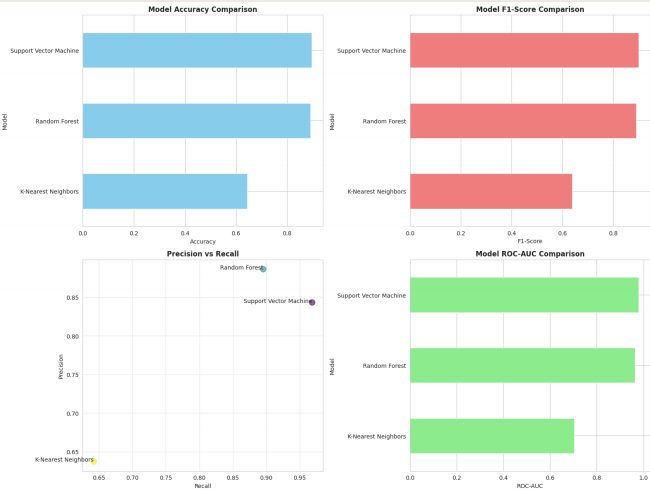
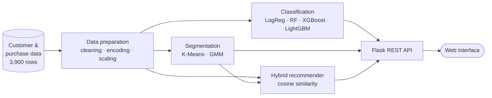
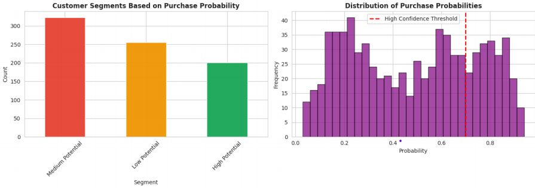
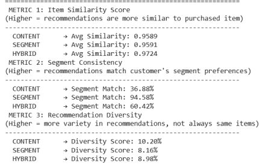

# ShopIntelligence — AI Customer Intelligence Platform

An end-to-end machine learning platform that turns customer and purchase data into business decisions. It **predicts high-value customers**, **segments the customer base** for targeted marketing and **recommends products in real time**, all served through a Flask web app and REST API.



---

## Highlights

- **3,900 customers**, 20 raw attributes, **130+ engineered features**
- **4 classifiers benchmarked**: Logistic Regression, Random Forest, XGBoost, LightGBM
- **5-fold stratified cross-validation** with Accuracy, F1 and ROC-AUC
- **Hybrid recommender** (content + segment + item similarity) with **0.97** average item similarity
- **Customer segmentation** with K-Means and Gaussian Mixture Models
- **Flask REST API** with a web interface
- Built with the **CRISP-DM** methodology, from business understanding to deployment

---

## Architecture



---

## The three models

### 1. High-value customer prediction (classification)
Each customer gets a **composite value score** built from six business indicators:

| Indicator | Weight |
|---|---|
| Purchase amount | 25% |
| Purchase history | 20% |
| Review rating | 15% |
| Web engagement | 15% |
| Subscription status | 15% |
| Purchase frequency | 10% |

The top 40% are labelled **high-value**. Four classifiers are trained and compared with 5-fold stratified cross-validation, and the best one is saved and served by the API.

### 2. Customer segmentation (clustering)
- **K-Means** groups customers into **4 segments** used by the recommender
- **Gaussian Mixture Model** provides a probabilistic segmentation for marketing analysis *(branch `feature/gmm-segmentation`)*



### 3. Hybrid product recommender
Recommendations combine three signals with cosine similarity:

| Signal | Weight |
|---|---|
| Content: customer profile similarity | 40% |
| Segment: what similar customers buy | 40% |
| Item similarity | 20% |



---

## REST API

| Method | Endpoint | Description |
|---|---|---|
| `POST` | `/predict` | Predict whether a customer is high-value |
| `POST` | `/recommend` | Top product recommendations for a customer |
| `POST` | `/segment-info` | Segment profile and characteristics |
| `GET` | `/customer-info/<id>` | Customer profile lookup |
| `GET` | `/available-items` | Product catalogue |
| `GET` | `/health` | Service and model status |

Web pages: `/` (landing page), `/predict-form` (prediction form) and `/test-clients` (sample customers).

---

## Tech stack

| Layer | Technologies |
|---|---|
| Language | Python |
| Data | Pandas, NumPy |
| Machine learning | scikit-learn, XGBoost, LightGBM, K-Means, Gaussian Mixture |
| Visualization | Matplotlib, Seaborn |
| Serving | Flask, REST API, joblib |
| Frontend | HTML, CSS, JavaScript |
| Method | CRISP-DM |

---

## Run it

```bash
git clone https://github.com/Boubakrifatma/ShopSense.git
cd ShopSense
pip install -r requirements.txt

# Train the recommender models (creates recommand_model/models/)
python recommand_model/train_model.py

# Optional: retrain the classification model
python train_optimized_model.py

# Start the app
python app.py
```

Then open **http://localhost:5000**.

---

## Project structure

```
ShopSense/
├── app.py                        # Flask app and REST API
├── train_optimized_model.py      # Classification: training and benchmark
├── recommand_model/
│   ├── train_model.py            # K-Means segmentation and hybrid recommender
│   └── predict.py                # Recommendation engine
├── templates/                    # Web pages
├── static/                       # CSS and JavaScript
└── shopping_behavior_updated (1).csv   # Dataset
```

---

## Branches

| Branch | Content |
|---|---|
| `main` *(default)* | Main application: classification, recommender and web app |
| `feature/gmm-segmentation` | Latest version, with GMM segmentation and the French interface |
| `fix/dataset-and-prediction` | Dataset and prediction fixes |
| `feature/ui-pages` | New pages and UI corrections |
